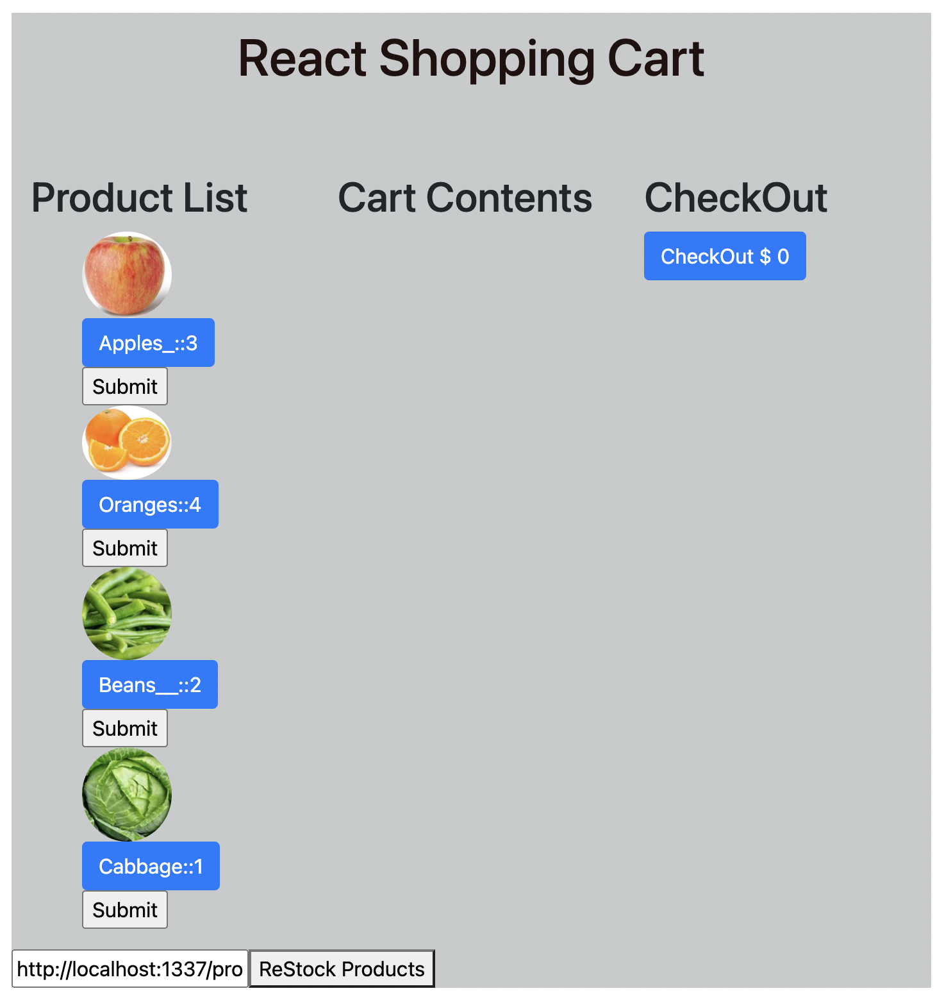

# 

<h1 align="center">Shopping Cart Exercise - Restocking Functionality</h1>
 

 

 

### Description 

- This exercise shows how to build a restocking functionality by integrating Strapi with a React application.
- It is accomplished by making a call to a Strapi API and getting a fresh list of available products.

Here’s how the reset stock feature works:

- There’s an input field on the page that contains the URL to the Strapi back end.
- When a user clicks the “ReStock Products” button, a call is made to the Strapi back end specified in the input field.
- The result of this call is an updated list of products.

### To run this program

Fork and Clone the repository to your local machine to create your own application.

### Future RoadMap

This project can be still be enhanced by adding more functionalities like tracking stock in cart and adding checkout functionality.

### License

This exercise stems from MIT xPRO Professional Certificate in Coding: Full Stack Development with MERN Program

> MIT License
> Copyright (c) 2022 Sujatha Arunagiri
> Permission is hereby granted, free of charge, to any person obtaining a copy
> of this software and associated documentation files (the "Software"), to deal
> in the Software without restriction, including without limitation the rights
> to use, copy, modify, merge, publish, distribute, sublicense, and/or sell
> copies of the Software, and to permit persons to whom the Software is
> furnished to do so, subject to the following conditions:
> The above copyright notice and this permission notice shall be included in all
> copies or substantial portions of the Software.
> THE SOFTWARE IS PROVIDED "AS IS", WITHOUT WARRANTY OF ANY KIND, EXPRESS OR
> IMPLIED, INCLUDING BUT NOT LIMITED TO THE WARRANTIES OF MERCHANTABILITY,
> FITNESS FOR A PARTICULAR PURPOSE AND NONINFRINGEMENT. IN NO EVENT SHALL THE
> AUTHORS OR COPYRIGHT HOLDERS BE LIABLE FOR ANY CLAIM, DAMAGES OR OTHER
> LIABILITY, WHETHER IN AN ACTION OF CONTRACT, TORT OR OTHERWISE, ARISING FROM,
> OUT OF OR IN CONNECTION WITH THE SOFTWARE OR THE USE OR OTHER DEALINGS IN THE
> SOFTWARE.
  
